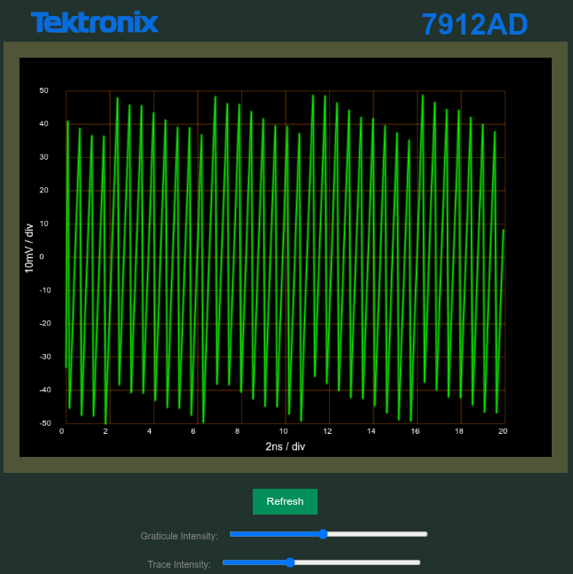

+++
title = "GPIB GUI"
date = "2025-10-01T01:25:38-05:00"
#dateFormat = "2006-01-02" # This value can be configured for per-post date formatting
#author = ""
#authorTwitter = "" #do not include @
#cover = ""
tags = ["gpib", "gui","7912ad","electronics"]
#keywords = ["", ""]
#description = ""
showFullContent = false
readingTime = false
hideComments = false
draft=false
+++

## intro

I have an unusual and rare piece of test equipment, the Tektronix [7912AD](https://w140.com/tekwiki/wiki/7912AD). It also happens to lack a built-in display and expects to talk to a computer. Hardly unusual today - just talk to the device over ethernet or wifi - but this device was introduced in the 1970s.

So why bother with something so old? A number of reasons: because of the challenge, because I ended up with it, because it's unusual, and because anything approaching its most impressive spec is incredibly expensive. See [purpose-built tech](#purpose-built-tech) below for details.

Fortunately, the communication method used (GPIB) was standardized, and remains in limited use today. I didn't have to reinvent the wheel to talk to it, but decoding and displaying the data still takes enough work to be a bit of fun.

As of this writing, I haven't completed the project - the 7912AD needs repair, and I don't want to risk further damage. While I've tabled this, I thought I'd share what I have done so far.

## data

### interlude: one standard, many names

Hewlett-Packard needed an interface bus to communicate between its products. HP invented HP-IB (Hewlett-Packard Interface Bus) and later released it for standardization. Due to outcry from other vendors, it was renamed GPIB (General Purpose Interface Bus) before standardization, where it was eventually named IEEE-488. Thus, a third name for this standard. And if you're feeling particularly pedantic, it was also standardized by the IEC as IEC 60625 (and later incorporated into IEC 60488), though I've yet to see any documentation using either IEC name for it.

### interfacing with GPIB

I searched github and found a project which uses an arduino to speak GPIB. Since I didn't want to throw a lot of money at my project, I opted to use this project, called AR488. AR for arduino, and 488 for IEEE-488. The first stumbling block was encountered almost right away: AR488 didn't support `secondary addressing`, an infrequently used GPIB option, while the 7912AD requires it. Freely available documention doesn't describe secondary addressing very well, so it took a few tries for the AR488 developer to get it working.

While GPIB is used for communication with my device, that doesn't mean as much as you might hope. The first edition of the standard only describes the low-level signalling, and it was early enough in the standard's life that each company or division was following its own conventions. 

At the time, GPIB data was most frequently sent as plain ASCII text. Tek opted for a binary format, possibly for speed or due to the volume of data. Tek hoped you would use their computers, with built-in support, but fortunately the devices's manuals describe the format fairly well. Most importantly, the manual includes real data - invaluable for verifying that my understanding of the text was correct. It took a couple tries, but I did eventually get code that worked with the examples.

Finding the correct command sequences took a bit of work - the manuals assumed I'd know a few things I didn't - and was complicated by using modern hardware. Apparently, the 7912 expected delays at a few points and my computer wasn't always giving it enough time. This resulted in it misbehaving from time to time (ignoring a command or locking up). Once I figured out the cause, I added some code to enforce a minimum delay between commands.

## gui

It seemed like the easiest gui would probably be via a web browser. I hit upon the idea of having it look as much as possible like an analog scope of the era, so I decided to use appropriate colors and to add controls. I haven't done much with javascript, so I opted to ask ChatGPT to write the html and javascript to pull the data from a backend, and to draw a graph with legend, graticule lines, and sliders to control the intensity and graticule (much like two of the knobs on a real analog scope). After some back-and-forth with ChatGPT, as well as some hand coding, I ended up with a passable representation of an analog scope display.

At the time I hadn't fully decoded the 7912's responses, so the backend started out just generating random-ish data. 



On my unit, the logo is black. A few years later they switched to blue, which I prefer, so I opted for that one in this gui.

### not so random

Obviously, if randomness is important, you want to use a pseudorandom number generator (PRNG), a cryptographically secure PRNG (CSPRNG), or dedicated hardware. I merely wanted something that wasn't a straight line, so I chose to use the least significant (most frequently changing) bits of a nanosecond timestamp:
```go
    // CAUTION: never do this for anything where randomness matters, such as crypto!
	y := time.Now().UnixNano() % 512 
	dd.Coordinates[i] = [2]int{i * 2, int(y)}
```

This does provide varying data, but it often results in an easily predictable pattern - as you can see in the above screenshot. Good thing no security is relying on the randomness!

### easter eggs

I wished to throw in a couple easter eggs, for example to mimic undesirable effects when an analog oscilloscope display is adjusted incorrectly. Chances are I'll do some more polishing, but it's not half bad:


```go
import "math/rand"

    // ...

    // PRNG: still not good enough for crypto
    y := rand.Intn(512)
	dd.Coordinates[i] = [2]int{i * 2, int(y)}
```

I could also add a CSPRNG screenshot, but it wouldn't really be meaningful: the human brain is really good at finding patterns, even where there are none, so the screenshot wouldn't be very informative. Finding true patterns (or lack thereof) would require far more sophisticated methods than the v1.0 eyeball. If you wish to read more, here are some wikipedia links: [Entropy (information theory)](https://en.wikipedia.org/wiki/Entropy_(information_theory)), [CSPRNG](https://en.wikipedia.org/wiki/Cryptographically_secure_pseudorandom_number_generator)




While searching for an intensity picture, I stumbled across a blog post ([linked below](#links)) about doing an accurate simulation. Their results are _far_ better than mine. I'll have to look into their algorithm, and if it isn't too complex or computationally expensive, I'll probably switch. 

----


If anyone has created a font to mimic Tek's analog readout text, I'll probably incorprate that as well. If it hasn't been done, I'm not sure I'll take the time to do it myself - that seems like a fair amount of effort.


## demo TBD

I wanted to include a demo, but I'm up against one or more hugo security features. It seems that hugo ignores any html files within a page bundle, and I've yet to figure out how to allow it. So at least for now, the closest you can get to a demo is the screenshots and the code. The code can be viewed in my prologix fork on the 7912_secondary_ar488 branch, under lib/serve: [link](https://github.com/mpictor/prologix/tree/7912_secondary_ar488/lib/serve). 

Note that this doesn't actually talk to a live device, just serves up one set of real data or one of two flavors of random data. The code that communicates with the 7912 over gpib can be seen on that same branch, in `examples/vcp/7912AD/7912ad.go`. They will eventually be linked, but aren't yet.

## on hold

Getting it to talk to the real device is on hold until said real device is back to working: [repair notes](posts/7912ad_repair_notes).

## purpose-built tech

As of this writing, ~ $40 000 on ebay will get you a used device that's still less than half as capable, _if_ you only consider that one spec. <!-- Granted, that if is doing an awful lot of work - the ebay device probably outperforms on every other spec. --> $40k gets you 80Gsa/s (80 billion samples per second), while the 7912ad is spec'd at 200Gsa/s. Much like a frame-by-frame replay of a fast event, such as how a horse runs, these devices can capture snapshots of an extremely fast signal so they can be sent to slower machines for analysis and storage.

Just considering this one spec generally isn't very useful, though: how many consecutive, high-speed samples _can_ be held for later analysis? This is where the 70's tech falls down. It can handle 512 samples, while something off ebay will easily handle many millions.

If a fast signal repeats, there are tricks that can be used to capture the data with a much slower (and cheaper) device. The 7912AD is a _transient_ digitizer, designed to capture extremely fast events that only happen once. From what I can tell, its purchasers were almost exclusively organizations doing things in the realm of high-energy physics: research with lasers, particle accelerators, and even fission and fusion.

Lacking my own multi-billion-dollar facilities, I'm sadly unable to carry on such research. But if I can get it repaired, it will still function as a fairly fast oscilloscope - and that, I _can_ put to use.


## additional links


The photo of a real analog scope's display is from a blog post about accurate simulation of phosphor persistence. archive.org link: https://web.archive.org/web/20250726232140/https://richardandersson.net/?p=350
Corresponding source code: https://github.com/RandomDude4/PhosPersPlot

TubeTime's comparison of phosphor types - https://www.youtube.com/watch?v=FCAKL-4NTrA

I need one of each.