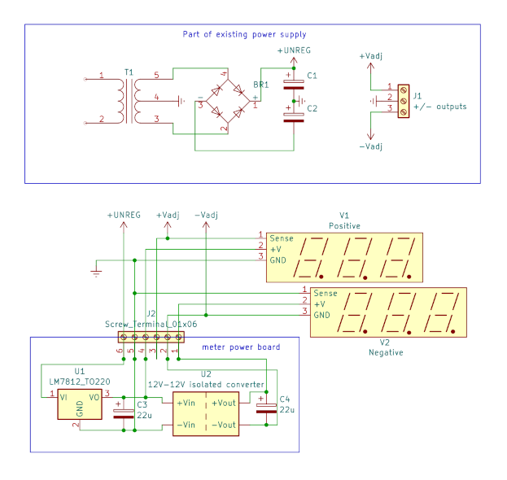
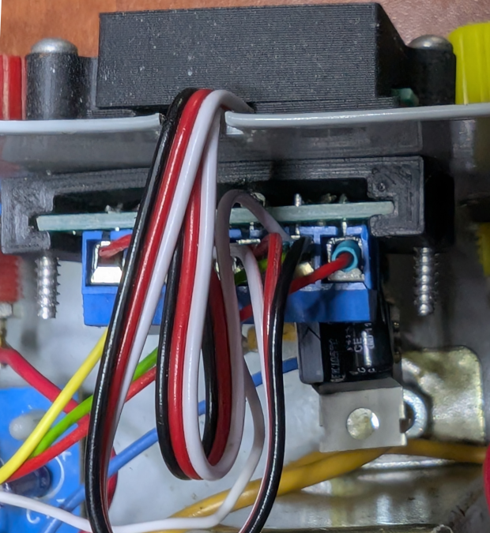
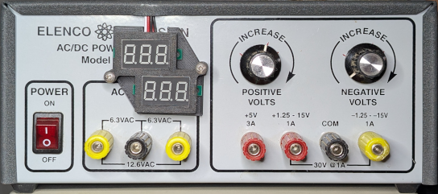
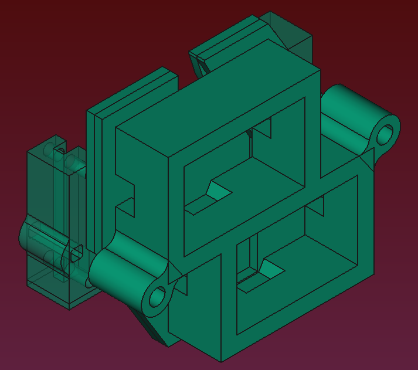

I have an old power supply with three outputs: +5V, +1.25 to +15V, and -1.25 to -15V. It has no readout, so you must attach a meter to it when making an adjustment. I found this rather annoying.

You can find cheap, 3-digit 0-30V voltmeters many places online, including the place that likes to claim its boxes use less material. These meters come in two variants:
* 2-wire. One wire is ground, the other combines sense and voltage supply.
* 3-wire. Ground, supply, and sense are separate.

With either variant, the minimum supply voltage is 3V, though the display is rather dim at that voltage. Because sense and power are combined, the 2-wire version isn't useful below 3V. The 3-wire version lacks that limit and is able to operate at least down to the minimum voltage of an LM317 voltage regulator (~1.2V). Both can be supplied by up to 30V and can measure up to 30V, though we won't be approaching either limit.

Aside from the wider sense range, there's another benefit to the 3-wire version: you can power it from a constant voltage and thus avoid the display brightness changing as the sensed voltage changes.

I chose the 3-wire variant, and the ones I got have two markings on the circuit board, `V1303` and `DVM036A`. Unfortunately, searching for either of those terms doesn't work too well. I had best luck searching `calibratable mini digital voltmeter`. I paid about $10 for 5 of them; since I had everything else necessary, the project cost only includes the two meters.

## positive meter

Connecting the meter to measure the positive supply isn't hard - you attach it to a supply voltage, a sense voltage, and ground. Ground is, of course, the common output terminal of the supply. Likewise, the sense wire is attached to the variable (positive) output terminal. 

For supply voltage, I chose 12V. This gives a bright display, but the real reason for this voltage is a component I happened to have a few extra of. We'll get to that when I discuss the circuit to measure negative voltage.

To generate the supply voltage, I used a LM7812 linear regulator fed from the same bulk filter caps that are used for the 0 to +15V regulator. A display or two is a tiny load; I'm not worried about drawing enough current to make a noticeable difference in the supply's output, nor am I worried about it heating the regulator to the point that a heatsink is needed.

If excess heat was generated, the easiest solution would be to replace the linear regulator with a switching supply. Electrically, this would be noisier, but it's unlikely to have an impact on meter accuracy. If it did somehow cause problems, an RC low-pass filter and/or inductive choke would fix it. Implementation is left as an exercise for the reader.

## negative meter

These meters can only measure postive voltage, so how exactly do we use one for the negative supply? This gets a bit tricky, but it can be done. 

So we somehow use a resistor network and do math on the meter's output? No, no resistor network and no need to do math every time you read the meter.

Consider the meter's wires: One (ground) must be more negative than the others. The sense wire can be up to 30V above that, though as with positive we won't be using its full range. Ignore the supply voltage for now - we'll get back to it.

Now consider the negative regulator's outputs. There's the ground terminal, and there's the negative output terminal. We can't connect the sense wire to the negative output, or we violate what we said above about sense. However, we would get a correct reading if we connect the meter's "ground" to the negative output and sense to the common (ground) terminal. We'll call the meter's ground a virtual ground to help alleviate the confusion of two grounds at different potentials.

But now the meter ground is going to shift around as the voltage varies. How will we give it the constant supply voltage mentioned above?! 

Now we get to the component that caused me to choose 12V as the supply voltage: a tiny, isolated 12V DC-DC converter. I happened to have several of these left over from another project and decided to use one here. It is supplied from the same regulator as the positive meter, yet because it's isolated it won't short circuit if we try to reference its output to something other than the system ground. We connect its negative output to the supply's negative output terminal, which means its positive output will always be 12V above that. Now, the negative meter has exactly the same thing as on the positive side: a (virtual) ground, a sense voltage more positive than that, and a supply voltage that's always 12V above its virtual ground. Thanks to the isolated converter, this floating supply voltage stays constant regardless of the voltage the output is set to.

If the negative output is set to 3V and we were to measure from the output ground terminal to the negative meter's supply, we would see 9V. This is because, for this measurement, the output ground terminal is 3V above the meter's ground. 12V - 3V = 9V.
If the negative output is set to 13V and we perform the same measurement, we would see that the negative meter's supply is 1V below the output ground terminal. In either case, the meter reports the correct voltage - just without the negative sign.

## finished circuit

<!--  -->

Note that terminal block pin 3 is not connected to anything on the circuit board - it's only used as a convenient spot to connect `V1`'s `sense` to the `+Vadj` wire.

## putting it together

Top view. Wires connecting to the rest of the supply:
* `-Vadj`: yellow 
* `ground`: green 
* `+UNREG`: red 
* `+Vadj`: white

The actual board is mirrored with respect to the schematic, putting pin 6 on the right.

The meter wires forming the larger loop (exiting the frame) are for the positive meter, while the smaller loop is negative. For the meters, white is sense and red and black are power and ground, respectively.

Note the notch cut in the front panel so the wires aren't squished by the top cover. A cheap nibbler was used; the panel was at or beyond the nibbler's stated capacity, but it did work.

I wanted to separate the meters and put each next to the corresponding knob, but lacked sufficient space. The only free space is where the meter's logo is (sorry, Elenco Precision!). The positive adjustment knob is on the left, so I arranged the positive meter above and to the left of the negative meter.

### 3d printed holder for the meters and circuit board

I printed a three-piece holder for the meters and circuit board. Two pieces (front and back) hold the meters, and a third goes inside for the board.

#### adjusting the model
If you actually print this, you may wish to increase the clearance around the meters - I remember needing to do a fair amount of cleanup before they would fit.

While you're making adjustments, find a pair of screws long enough and adjust the screw hole diameter to match. You want a clearance fit on the outside two parts, while on the inside you want holes small enough for the threads to bite but not so small that the screws cause cracks.

For threads, I use square holes with rounded corners. I size them such that the screw's minor diameter need not touch the walls, while the major diameter (the threads) bites into the walls but has little or no contact at the corners. So far, I've had very good luck with this method.

## design files
The schematic (KiCad) and 3d model (FreeCAD) may be found [here](https://github.com/mpictor/mpictor.github.io/tree/main/ancillary/isolated_voltmeter) on github. 

Since the model likely needs adjusted, I am not providing slicer-ready files. Once you've tweaked the model in FreeCAD, select one body and use `File|Export`, exporting to stl, amf, or whatever other format you prefer. Repeat with the other two bodies.

----

Note that this project was completed in 2024, but I didn't think to create the schematic or write it up until 2025 - so mistakes may have crept in. Please let me know if you spot one.
