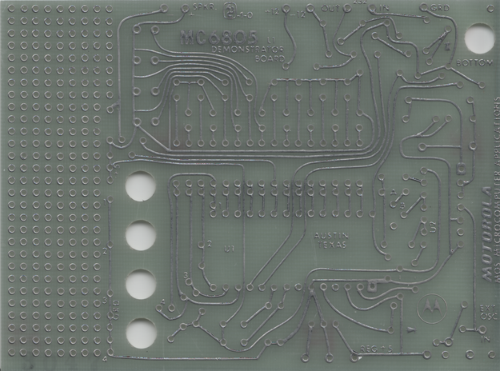
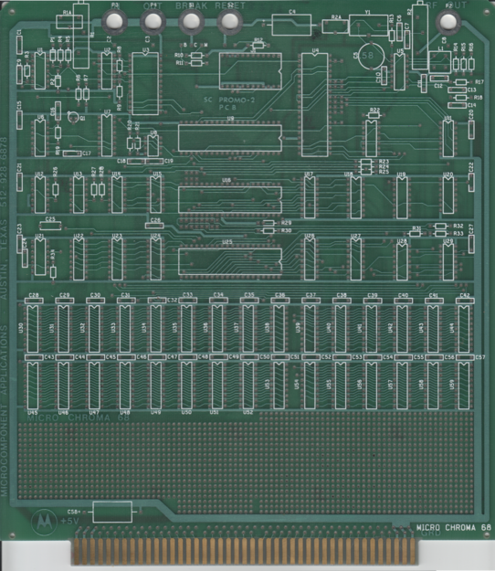
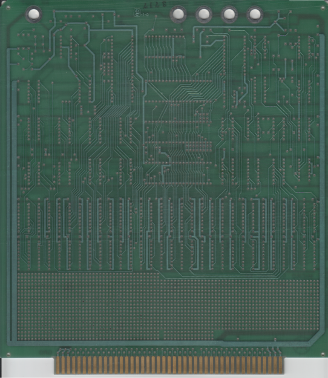

+++
date = '2025-09-27T19:04:37-05:00'
draft = false
title = 'Unpopulated Motorola circuit boards'
summary = 'Motorola PCBs that may be of interest to the retro community'
tags = ["electronics","motorola","mc6805","retro"]
+++

Perhaps these are of interest to someone in the retro community. Link to high-res versions at bottom.

These boards come from the estate of a retired Motorola engineer.

## MC6805 Demonstrator Board

Text includes

> MC6805 DEMONSTRATOR BOARD
>
> MOTOROLA
>
> MOS MICROCOMPUTER APPLICATIONS

I have several of these.

## Micro Chroma 68

top

bottom

Text includes

> MICROCOMPONENT APPLICATIONS AUSTIN, TEXAS
>
> SC PROMO-2 PCB
>
> MICRO CHROMA 68

Unfortunately I only have the PCB. The `promo` text makes me wonder if this version was given away as some sort of promotion.

----

High resolution images of both boards may be found [here](https://github.com/mpictor/mpictor.github.io/tree/main/ancillary/motorola_mc68xx) on github. 